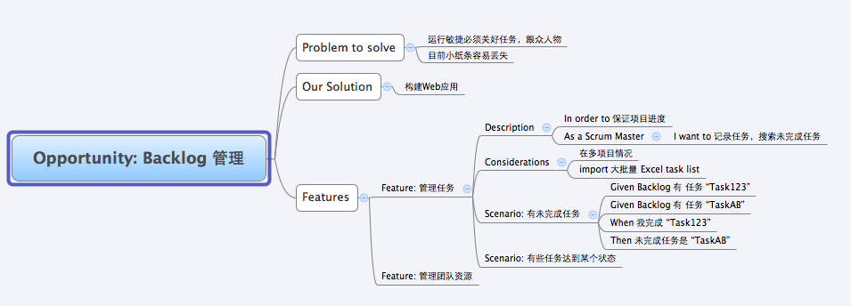

Cucumber-jvm tutorial Part 02
=============================

This is the second part of the tutorial where we explore requirements. 
In this tutorial, we use the example of a backlog management system.

### requirements
We explore the requirements using mind-mapping and store the results in the opportunity.xmind file. 

  
We explore a number of features and each feature has a number of scenarios expressed 
using natural language in the Gherkin format (i.e. Given, When Then, etc.) 

We then zoom in to a feature (using F6 in XMind) and export the feature to a *.feature file.
[BacklogManagement.feature](requirements/features/BacklogManagement.feature)
````
Feature: 管理任务
	Description
		In order to 保证项目进度
		As a Scrum Master
		I want to 记录任务，搜索未完成任务
	Considerations
		在多项目情况
		import 大批量 Excel task list

Scenario: 有未完成任务
	Given Backlog 有 任务 "Task123"
	Given Backlog 有 任务 "TaskAB"
	When 我完成 "Task123"
	Then 未完成任务是 "TaskAB"

Scenario: 有些任务达到某个状态
````

[TOP](https://github.com/ngpanwei/cucumber-jvm-tutorial)
[1](https://github.com/ngpanwei/cucumber-jvm-tutorial/bdd-part-01-skeleton/README.md)
[2](https://github.com/ngpanwei/cucumber-jvm-tutorial/bdd-part-02-features/README.md)
[3](https://github.com/ngpanwei/cucumber-jvm-tutorial/bdd-part-03-test-skeleton)
[4](https://github.com/ngpanwei/cucumber-jvm-tutorial/bdd-part-04-test-code)
[5](https://github.com/ngpanwei/cucumber-jvm-tutorial/bdd-part-05-elaborate)
