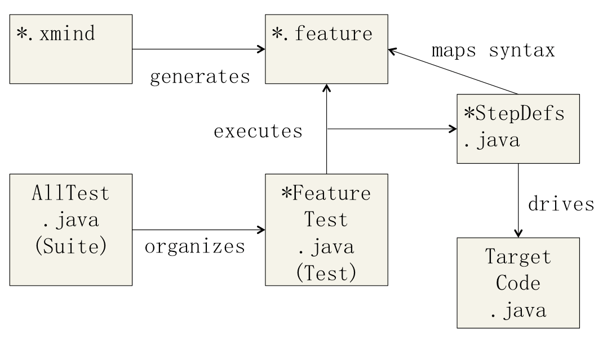

Cucumber-jvm tutorial Part 04
=============================

In this part 4 of the tutorial, we write both the test code and the actual code.
At this point, we start to have a number of files. Let's take a brief moment to recap the type of files 
we have:


- *.xmind - this is the mind map for us to work with customers to explore requirements and features
- *.features - this is to express requirements as acceptance tests using the Gherkin language.
- *StepDefs.java - are files that are use to map the steps in the *.feature files into test code. 
		We call these Step Definition classes. They are also called glue codes.
- *FeatureTest - these are JUnit test cases that links feature files and glue codes. We normally have one 
	*FeatureTest for several related *.features.
- *Test - these are JUnit test suites, that organizes FeatureTests.


We update the step definition file 
[test/ngpanwei/bdd/stepdefs/BacklogStepDefs.java](test/ngpanwei/bdd/stepdefs/BacklogStepDefs.java)
````java
public class BacklogStepDefs {
	Backlog backlog = null ;
	@Before
	public void setup() {
		backlog = new Backlog() ;
	}

	@Given("^Backlog 有 任务 \"(.*?)\"$")
	public void backlog_有_任务(String taskName) throws Throwable {
		Task newTask = backlog.add(taskName) ;
		assertNotNull(newTask) ;
	}

	@When("^我完成 \"(.*?)\"$")
	public void 我完成(String taskName) throws Throwable {
		Task task = backlog.setTaskStatus(taskName,Task.STATUS_DONE) ;
		assertNotNull("task should exist in backlog",task) ;
	}

	@Then("^未完成任务是 \"(.*?)\"$")
	public void 未完成任务是(String taskName) throws Throwable {
		List<Task> tasks = backlog.getUnompleteTask() ;
		Task task = tasks.get(0) ;
		assertEquals(task.getName(),taskName) ;
	}
}
````

There are two implementation class that we create
[src/ngpanwei/backlog/Backlog.java](src/ngpanwei/backlog/Backlog.java) and 
[src/ngpanwei/backlog/Task.java](src/ngpanwei/backlog/Task.java).
We use a simple POJO (Plain O' Java Object) implementation to simplify our tutorial. 
We do not use any sophisticated implementation such as databases, etc. because our 
goal is to gain familiarity with the BDD approach and the cucumber-jvm mechanics.

[src/ngpanwei/backlog/Backlog.java](src/ngpanwei/backlog/Backlog.java)
````java
public class Backlog {
	private HashMap<String,Task> taskMap ;
	public Backlog() {
		taskMap = new HashMap<String,Task>() ;
	}
	public Task add(String taskName) {
		Task newTask = new Task(taskName) ;
		taskMap.put(taskName,newTask) ;
		return newTask ;
	}
	public Task getTask(String taskName) {
		Task task = taskMap.get(taskName) ;
		return task ;
	}
	public Task setTaskStatus(String taskName, String status) {
		Task task = getTask(taskName) ;
		task.setStatus(status);
		return task ;
	}
	public List<Task> getUnompleteTask() {
		List<Task> uncompletedTasks = new ArrayList<Task>() ;
		for(Entry<String,Task> entry : taskMap.entrySet()) {
			Task task = entry.getValue() ;
			if(!task.getStatus().equals(Task.STATUS_DONE)) {
				uncompletedTasks.add(task) ;
			}
		}
		return uncompletedTasks ;
	}
}

````
We assume that you know HashMaps, Lists, etc. in this tutorial.

[src/ngpanwei/backlog/Task.java](src/ngpanwei/backlog/Task.java)
````java
public class Task {
	public static final String STATUS_TODO = "TODO" ;
	public static final String STATUS_DOING = "DOING" ;
	public static final String STATUS_DONE = "DONE" ;

	private String name ;
	private String status ;
	public Task(String taskName) {
		name = taskName ;
		status = STATUS_TODO ;
	}
	public String getName() {
		return name;
	}
	public void setName(String name) {
		this.name = name;
	}
	public String getStatus() {
		return status;
	}
	public void setStatus(String status) {
		this.status = status;
	}
}
````

[TOP](https://github.com/ngpanwei/cucumber-jvm-tutorial/blob/master/README.md)
[1](https://github.com/ngpanwei/cucumber-jvm-tutorial/blob/master/bdd-part-01-skeleton/README.md)
[2](https://github.com/ngpanwei/cucumber-jvm-tutorial/blob/master/bdd-part-02-features/README.md)
[3](https://github.com/ngpanwei/cucumber-jvm-tutorial/blob/master/bdd-part-03-test-skeleton/README.md)
[4](https://github.com/ngpanwei/cucumber-jvm-tutorial/blob/master/bdd-part-04-test-code/README.md)
[5](https://github.com/ngpanwei/cucumber-jvm-tutorial/blob/master/bdd-part-05-elaborate/README.md)
[6](https://github.com/ngpanwei/cucumber-jvm-tutorial/blob/master/bdd-part-06-spring/README.md)
[7](https://github.com/ngpanwei/cucumber-jvm-tutorial/blob/master/bdd-part-07-selenium/README.md)

